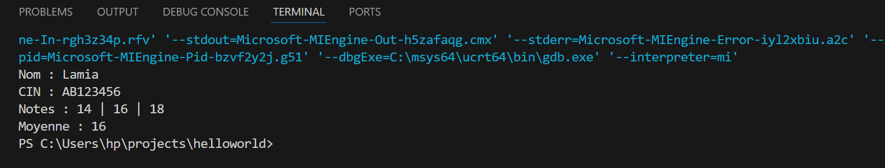
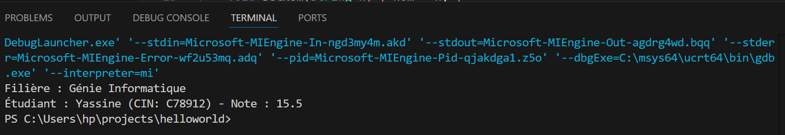

#  TP2 : Encapsulation  
---

##  Objectif pédagogique
Ce TP a pour but de **maîtriser l'encapsulation** en C++, c’est-à-dire :  
- protéger les données privées (`private`)  
- utiliser des **getters et setters** pour accéder et modifier ces données  
- créer des **méthodes publiques** pour manipuler les objets de manière sécurisée  

---


#  Exercice 1 : Gestion d’un étudiant

###  Énoncé
Créer une classe `Etudiant` qui représente un étudiant avec les informations suivantes :  
- `nom` (string)  
- `cin` (string)  
- `note1`, `note2`, `note3` (float, sur 20)  

Les données doivent être **encapsulées**. Fournir :  
- les **getters** et **setters** pour chaque attribut  
- une méthode `calculMoyenne()` qui retourne la moyenne des trois notes  
- une méthode `afficher()` qui affiche toutes les informations de l’étudiant  

---
### Résultat attendu :

```bash
Nom : Lamia
CIN : AB123456
Notes : 14 | 16 | 18
Moyenne : 16

```

## Exemple d’exécution (image)

Voici un exemple de l'exécution du programme (screenshot) :




#  Exercice 2 : Association Étudiant – Filière

##  Objectif pédagogique

Modéliser une **association simple 1 à 1** entre un étudiant et sa filière, en utilisant l'encapsulation et les méthodes d'accès en C++.

---

##  Énoncé
Créer deux classes :  

1. **Etudiant** : avec les attributs
   - `nom` (string)
   - `cin` (string)
   - `note` (float)  
   et des **getters/setters** ainsi qu'une méthode `afficher()`.

2. **Filiere** : avec les attributs
   - `nomFiliere` (string)
   - `etudiant` (objet Etudiant)  
   et des méthodes `setEtudiant()` et `afficher()`, qui affiche le nom de la filière et les informations de l’étudiant inscrit.

---

## Résultat attendu

```bash
Filière : Génie Informatique
Étudiant : Yassine (CIN: C78912) - Note : 15.5

```
## Exemple d’exécution (image)

Voici un exemple de l'exécution du programme (screenshot) :




## UML – Association

``` lua
+--------------------+        +-----------------------------+
|      Filiere       |<>------|          Etudiant           |
+--------------------+        +-----------------------------+
| - nomFiliere       |        | - nom    : string           |
| - etudiant         |        | - cin    : string           |
+--------------------+        | - note   : float            |
| + setNomFiliere()  |        | + get/set pour chaque champ |
| + setEtudiant()    |        | + afficher()                |
| + afficher()       |        +-----------------------------+
+--------------------+

```
